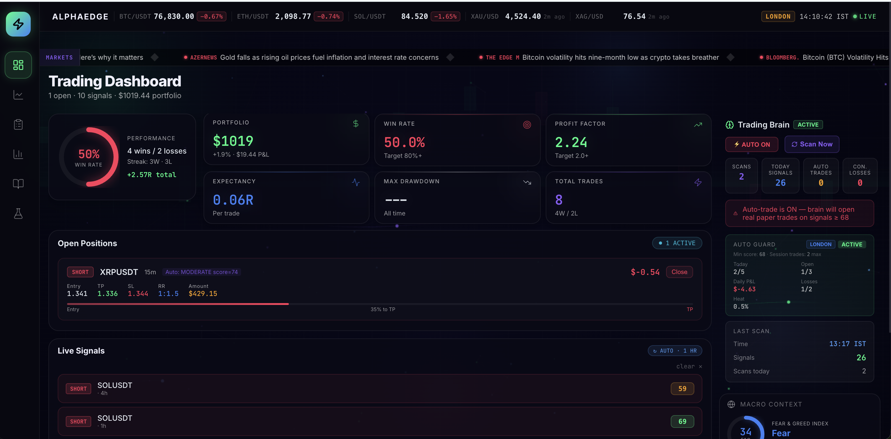

<div align="center">

# ⚡ AlphaEdge

### Autonomous Crypto Trading Intelligence Platform

[](https://python.org)
[](https://fastapi.tiangolo.com)
[](https://react.dev)
[](https://supabase.com)
[](https://vercel.com)
[](https://render.com)

**🟢 Live — Currently in paper trading validation phase**

</div>

---

## What is AlphaEdge?

AlphaEdge is a fully autonomous paper trading intelligence system built for crypto futures markets. It continuously scans BTC, ETH, SOL, XRP, and BNB across multiple timeframes, scores trading setups using a proprietary multi-strategy confluence engine, and automatically executes paper trades with professional-grade risk management — 24 hours a day, 6 days a week, without any manual intervention.

Think of it as a personal trading desk that never sleeps, never acts on emotion, and always follows the rules.

---

## Dashboard Preview



---

## How It Works

```
Market Data (Binance WebSocket)
         ↓
   Brain Scanner (every 60 min)
   Scores 5 assets × 3 timeframes = 15 combinations
         ↓
   Multi-Strategy Confluence Engine
   6 strategies scored simultaneously
         ↓
   Risk Guard (7 rules checked)
   Session rules + portfolio limits
         ↓
   Position Sizer (1% risk per trade)
   ATR-based SL, auto-calculated TP
         ↓
   Auto-Trade Execution
   Paper trade placed in database
         ↓
   Trade Monitor (every 30 sec)
   TP / SL / Breakeven / Trailing / Timeout
         ↓
   Auto-Journal + Portfolio Update
```

---

## Key Features

**🧠 Intelligent Brain Scanner**
- 6 independent trading strategies scored per asset per timeframe
- Smart Money Concepts (SMC), EMA Trend, Fibonacci, ICT Killzone, Breakout, Mean Reversion
- Daily bias filter using Higher Timeframe EMA analysis
- Funding rate integration from Binance Futures API
- Open Interest confirmation filter
- Weekly and Monthly magnetic level detection for TP placement

**🛡️ Professional Risk Management**
- Fixed fractional position sizing — always risks 1% of portfolio per trade
- ATR-based stop loss placement per timeframe
- Minimum 1:1.5 to 1:2 risk/reward enforcement before any trade fires
- Portfolio heat limit — max 5% total exposure across all open trades
- Daily drawdown stop — trading pauses if down 3% in a single day
- Consecutive loss protection — 2 back-to-back losses stops trading for the day
- No hedging — system will never open opposite positions on same asset
- No weekend trading

**⏰ Session-Aware Execution**
- Asia session (05:30–12:30 IST): max 2 trades, higher score threshold
- London session (13:00–19:00 IST): max 2 trades, standard threshold
- New York session (19:00–00:30 IST): full capacity, score bonus applied
- Off-hours (00:30–05:30 IST): hard block, no new trades
- US high-impact news events (FOMC, CPI, NFP, PCE): auto-pause
- Exception: exceptionally high-scoring setups can override news block at reduced position size

**📊 Real-Time Dashboard**
- Live price feed via Binance WebSocket (BTC, ETH, SOL, XRP, BNB, XAU/USD)
- Live brain scan pipeline with animated signal feed
- Open positions with real-time progress bar to take profit
- Performance attribution by strategy, session, and asset
- Auto Guard status widget showing all 7 risk rules live
- Macro context panel (Fear & Greed Index, DXY, Economic Calendar)
- Rolling news ticker from financial sources

**📓 Automated Journal**
- Every trade entry and exit auto-logged with full detail
- Sizing breakdown, confluence notes, R-multiple recorded per trade
- Scan journal with complete signal history
- Filterable tabs — Trades vs Scans

**🔬 Backtesting Engine**
- Walk-forward simulation on real historical OHLCV data
- Zero look-ahead bias architecture
- Per-strategy equity curve visualisation
- Win rate, profit factor, max drawdown, expectancy metrics

---

## Architecture

```
┌──────────────────────────────────────────────────────────┐
│                        Frontend                           │
│          React 18 + Vite  →  Vercel (CDN)                │
│   TradingView Charts | Recharts | Zustand | React Query   │
└──────────────────────┬───────────────────────────────────┘
                       │  REST API + WebSocket
┌──────────────────────▼───────────────────────────────────┐
│                        Backend                            │
│            FastAPI (Python 3.11)  →  Render.com           │
│   APScheduler | Binance WS | aiohttp | Supabase SDK       │
└──────────────────────┬───────────────────────────────────┘
                       │  PostgreSQL
┌──────────────────────▼───────────────────────────────────┐
│                       Database                            │
│                  Supabase (PostgreSQL)                    │
│    Trades | Signals | Journal | Portfolio | Metrics       │
└──────────────────────────────────────────────────────────┘
```

---

## Tech Stack

| Layer | Technology |
|-------|-----------|
| Frontend | React 18, Vite, TradingView Lightweight Charts v4 |
| Styling | Custom dark theme, Framer Motion animations |
| State Management | Zustand, React Query, WebSocket hooks |
| Backend | FastAPI, Python 3.11, APScheduler, aiohttp |
| Database | Supabase (PostgreSQL) |
| Market Data | Binance WebSocket, Binance Futures REST API |
| Macro Data | Finnhub API, Alpha Vantage |
| Deployment | Vercel (frontend), Render.com (backend) |
| CI/CD | GitHub Actions (auto-deploy + keep-alive pings) |

---

## Project Status

🟢 **Live and running fully autonomously**

The system scans markets every hour across 15 asset-timeframe combinations, executes paper trades automatically when setups qualify, monitors open positions every 30 seconds for TP/SL/breakeven/trailing stop, and journals everything automatically.

---

## About

Built entirely from scratch as a personal project to combine professional trading methodology with modern software engineering. The system implements concepts from Smart Money Concepts (SMC), ICT methodology, and systematic risk management principles used by professional trading firms.

---

<div align="center">

*Built with ☕ and way too many late nights*

</div>
